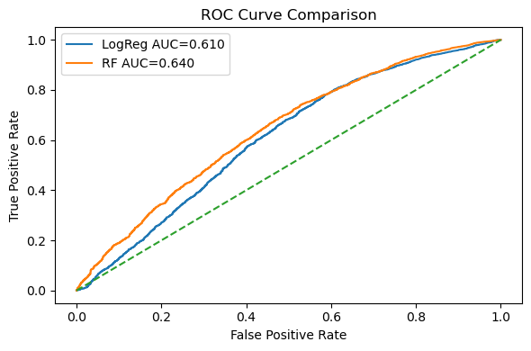
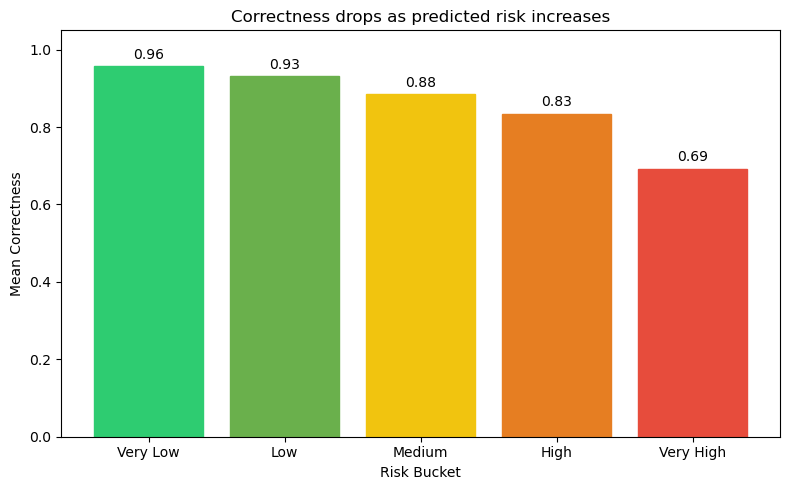
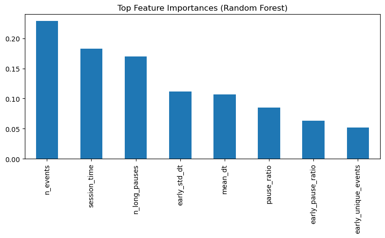
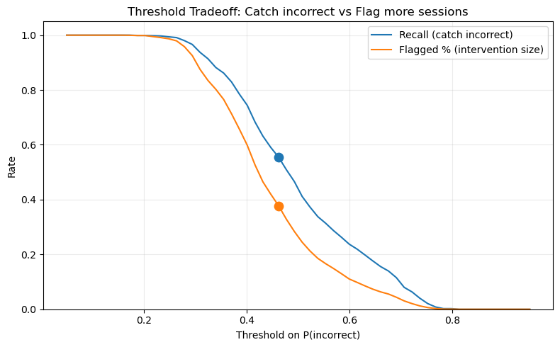

# Early-Gameplay-Risk-Scoring
Early Session Behavioral Risk Modeling Using Gameplay Telemetry Data

## Project Highlights

- Early-session risk scoring framework
- Group-based validation to prevent leakage
- Random Forest ROC AUC: 0.64
- Captures 44% of incorrect cases by flagging 20% of sessions
- Threshold optimization balances recall and intervention size

## Project Overview

This project develops an early-session risk scoring framework to identify gameplay sessions that are more likely to result in incorrect outcomes.

The core objective is to determine whether early behavioral signals (first 20 actions) contain meaningful predictive information that can support targeted intervention strategies.


## Dataset

**Source:** Kaggle – Predict Student Performance from Game Play  

The dataset includes:
- Question-level labels (`train_labels.csv`)
- Session-level gameplay logs (`train.csv`)
- Approximately 424,000 labeled question attempts

> Note: The full dataset is not included in this repository due to size constraints.

### Dataset Access

Due to Kaggle licensing and dataset size limitations, the raw dataset files are **not included** in this repository.

To reproduce this project:

1. Create a Kaggle account
2. Visit the competition page:  
   https://www.kaggle.com/competitions/predict-student-performance-from-game-play
3. Download:
   - `train.csv`
   - `train_labels.csv`
4. Place both files in the project root directory before running the notebook


## Methodology

### Feature Engineering

Two categories of behavioral features were engineered:

**1. Overall Session-Level Features**
- Number of events  
- Session duration  
- Mean time between actions  
- Long pause count  
- Event diversity  
- Pause ratio  

**2. Early-Session Features (First 20 Actions)**
- Early mean timing  
- Early pause ratio  
- Early timing volatility (`early_std_dt`)  
- Early action diversity  

### Modeling Approach

- Logistic Regression (baseline)
- Random Forest (nonlinear model)
- Group-based train-test split to prevent session-level leakage
- Evaluation using ROC AUC


## Results

| Model | ROC AUC |
|-------|---------|
| Logistic Regression | 0.61 |
| Random Forest | 0.64 |

## Visualizations

### ROC Curve Comparison


### Risk Bucket Performance


### Feature Importance


### Threshold Tradeoff



### Risk Stratification

- Top 20% highest-risk sessions contain ~44% of incorrect outcomes  
- Threshold optimization captures ~55% of incorrect cases while flagging ~38% of sessions  

Although overall predictive strength is moderate, the risk score effectively ranks sessions by difficulty and supports targeted intervention strategies.


## Key Insights

- Early behavioral instability (timing volatility and pauses) is predictive of incorrect outcomes.
- Nonlinear modeling improves performance over linear baseline.
- Preventing session-level leakage reduces inflated performance estimates.
- Moderate AUC can still provide operational value when used for ranking and prioritization.


## Limitations

- 20% sampling of gameplay logs due to computational constraints  
- Class imbalance (~14% incorrect sessions)  
- Smaller sample sizes in later level groups  
- Model performance is moderate and not production-ready  


## How to Run

1. Download the dataset from Kaggle  
2. Update the `DATA_DIR` path inside the notebook  
3. Install dependencies:

```
pip install -r requirements.txt
```

4. Run:

```
Early_Gameplay_Risk_Scoring.ipynb
```


## Repository Structure

```
Early-Gameplay-Risk-Scoring/
│
├── notebooks/
│ └── Early_Gameplay_Risk_Scoring.ipynb
│
├── figures/
│
├── presentations/
│ └── Final_Presentation.pptx
│
├── reports/
│ └── Final_Report.pdf
│
├── requirements.txt
├── README.md
└── .gitignore
```


## Author

Malik Ibrahim Ali Khan  
Master’s in Data Science – Regis University
